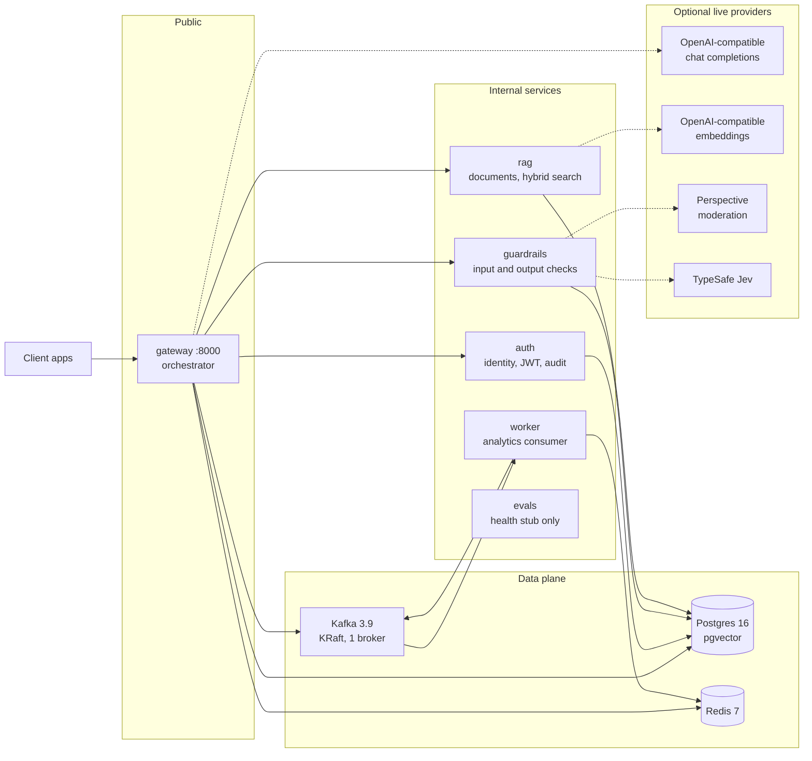
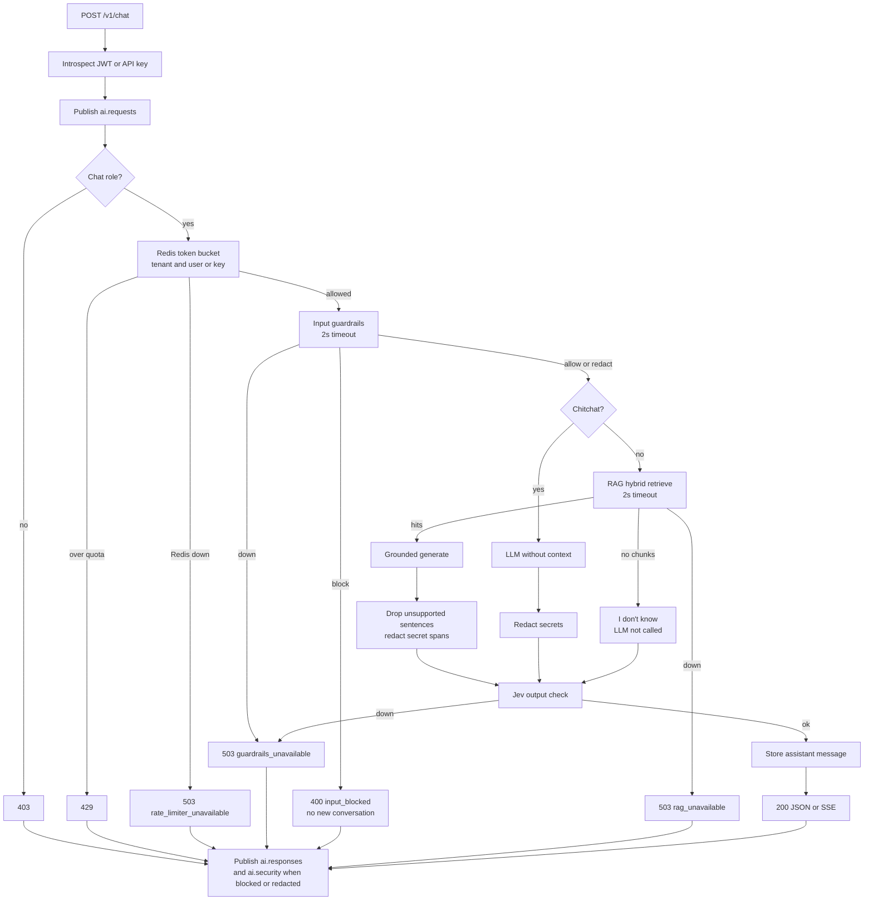
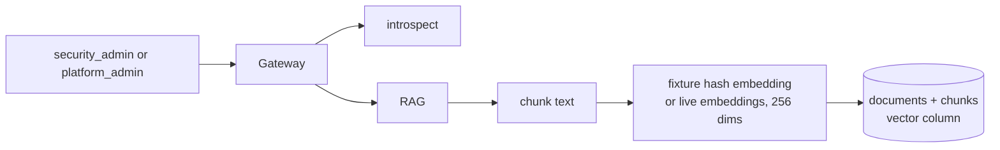
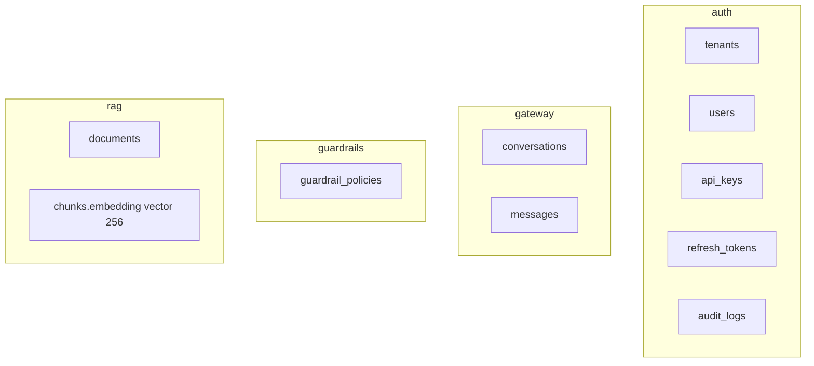

# Architecture (implemented through Version 8)

Docker-first middleware between applications and LLM providers. The gateway is the only public port (`localhost:8000`). Auth, guardrails, RAG, and the analytics worker stay on the Compose network. OpenAPI version on the gateway is **0.7.0**.

This is what is running now. Grafana, Kubernetes, Prometheus, and golden-set faithfulness evals are later versions. `services/evals` is a health stub and is not on the request path.

Chat sequence detail lives in [request-path.md](request-path.md).

## Runtime

Solid arrows are always used. Dashed arrows are used only when that provider is switched from fixture to live. Compose defaults are fixture and keyless.

The `web` container (published on port 5173) is a static client, not a hop on this diagram. The browser loads the console from `web` and then calls only public `/v1` routes on `localhost:8000`. The gateway allows that browser origin through `CORS_ORIGINS` (default `http://localhost:5173`). The console does not receive `INTERNAL_AUTH_TOKEN` or any other service secret, and it does not call worker counts.

`migrate` runs once at startup: auth schema, then gateway, then guardrails, then rag. It exits 0 before the app containers serve traffic.

## What each container owns

| Container | Owns | Does not own |
|-----------|------|----------------|
| `gateway` | Chat orchestration, rate limits, conversations, citation checks, output secret redaction, SSE, Kafka publish, LLM calls | JWT secret, guardrail key, Jev key, embedding key, user tables |
| `auth` | Tenants, users, API keys, refresh tokens, audit log, HS256 tokens | Chat, documents, policies |
| `guardrails` | Input rules, per-tenant policy, Perspective or fixture moderation, Jev fixture or live, thin output check | Retrieval, generation |
| `rag` | Ingest, chunk, embed, hybrid retrieve, ACL, secret masking in chunk text | Generation |
| `worker` | Consume metadata events, count them, dead-letter after 3 retries | HTTP chat status |
| `evals` | `GET /health` only | Scoring. The gateway does not call it and does not publish `ai.evaluations` |
| `web` | Static explainer and playground for the public API | Internal routes, service secrets, generation, and a place on the request path |

Shared libraries (no service imports):

| Package | Role |
|---------|------|
| `packages/contracts` | Pydantic models and ports: `AuthProvider`, `Guardrail`, `Retriever`, `LLMClient`, `Evaluator` |
| `packages/config` | Environment settings |
| `packages/telemetry` | JSON logs with correlation id, and `user_id` / `tenant_id` when known |
| `packages/testing` | Fake port implementations |

`packages/*` does not import `apps/*` or `services/*`.

## Public API

Only the gateway is published. Login and refresh are proxied without a prior token. Every other `/v1/*` route requires a Bearer JWT or `X-API-Key`.

| Route | Who | Behind it |
|-------|-----|-----------|
| `GET /v1/health` | anyone | liveness |
| `GET /v1/ready` | anyone | Postgres, Redis, auth, guardrails, rag, and Kafka. Does not ping a live LLM |
| `POST /v1/auth/login`, `refresh`, `logout` | login and refresh are open | auth |
| `GET /v1/me`, `POST /v1/me/api-keys` | authenticated | auth |
| `GET /v1/audit` | tenant-scoped | auth `audit_logs` |
| `GET/POST/PATCH/DELETE /v1/admin/...` | platform admin | tenants, users, API keys |
| `POST /v1/chat` | chat roles; viewer is 403 | full pipeline below |
| `GET /v1/conversations` | tenant-scoped readers | gateway Postgres |
| `POST/GET/DELETE /v1/documents` | `security_admin` or `platform_admin` | rag |
| `GET/PATCH /v1/guardrails/policy` | `security_admin` or `platform_admin` | guardrails |

`platform_admin` may pass `tenant_id` to act in another tenant. Every other role is filtered to `ctx.tenant_id`.

Roles in the seed: `platform_admin`, `security_admin`, `app_user`, `viewer`, plus service-account API keys.

The worker exposes `GET /internal/v1/counts` with `X-Internal-Token`. That route is not on the gateway.

## Chat path

`POST /v1/chat` is the only generation path. RAG does not generate.

Publish timeout defaults to 0.5s. A broker error is logged and does not change the HTTP status. Streaming still generates the full answer, verifies it, runs the output check, then replays the final text as SSE (`meta`, `token`, `done`).

Inside RAG retrieve, in order:

1. Tenant filter.
2. Classification and ACL. Empty ACL means every role in the tenant. `confidential` is `security_admin` and `platform_admin`. `restricted` is `platform_admin` only.
3. Vector search and Postgres full-text search (`RAG_CANDIDATE_K`, default 32).
4. Reciprocal rank fusion (`k = 60`).
5. Secret masking (`sk-`, `agt_`, `password=`, AWS access-key ids become `[SECRET]`).
6. Token-overlap rerank, dedupe, then an 8000-character budget (`RAG_TOP_K` default 8).

Citation check: each answer sentence must share at least half of its tokens with one returned chunk. Unsupported sentences are dropped. If none remain, the same I-don't-know string is returned. `groundedness` is the share of checked sentences that were kept. It is `null` for chitchat and the no-chunk path. `debug: true` returns ranks and drop reasons for `security_admin` and `platform_admin` only, with no chunk text.

## Document ingest

Decoded text over 256 KiB is `400 payload_too_large`. Delete cascades chunks and vectors. The document body keeps the original secret. The text sent to the model is the masked chunk.

## Data

One Postgres database. Each service migrates its own tables.

Redis keys:

| Key | Writer | Use |
|-----|--------|-----|
| `rl:tenant:{id}`, `rl:user:{id}`, `rl:key:{prefix}` | gateway | token buckets, burst 2× the per-minute limit |
| session cache | gateway | recent messages for a conversation |
| `kafka:event:{event_id}` | worker | lock, then skip a redelivery already counted |

Kafka topics, one partition, replication factor 1, created by the gateway on startup:

| Topic | Publisher | Payload |
|-------|-----------|---------|
| `ai.requests` | gateway, after auth | metadata only |
| `ai.responses` | gateway, when the HTTP status is decided | metadata only |
| `ai.security` | gateway, on input block, output block, `citation_unverified`, or output secret redaction | metadata only |
| `ai.evaluations` | nobody yet | topic exists so the worker can count it later |
| `*.dlq` | worker, after 3 failed attempts | the same event |

`ChatEvent` carries ids, status, latency, rule ids, citation count, and groundedness. It has no prompt, answer, chunk text, or secret span. The worker group is `aigateway-analytics`.

## Credentials

| Secret | Lives on |
|--------|----------|
| `JWT_SECRET` | auth |
| `GUARDRAILS_API_KEY` | guardrails |
| `JEV_API_KEY` | guardrails |
| `EMBEDDING_API_KEY` | rag |
| `OPENAI_API_KEY` | gateway |
| `INTERNAL_AUTH_TOKEN` | gateway, auth, guardrails, rag, worker |

Internal calls (introspect, audit, guardrail check, retrieve, ingest) send `X-Internal-Token`. Missing credentials, invalid tokens, and cross-tenant access fail closed (401 or 403).

| Dependency down | Chat result |
|-----------------|-------------|
| Redis | 503 `rate_limiter_unavailable` |
| Guardrails, or slower than 2s | 503 `guardrails_unavailable` |
| RAG, or slower than 2s | 503 `rag_unavailable` |
| Live LLM down, slower than 30s, or missing key/model | 503 `llm_unavailable` |
| Kafka at ready time | `/v1/ready` is 503 |
| Kafka after ready | chat status unchanged; event dropped |

Logs are JSON. They include the correlation id and, when known, `user_id` and `tenant_id`. They never include raw passwords, refresh tokens, full API keys, prompts, answers, dropped sentences, secret spans, document bodies, or chunk text.

## Not in this slice

- Evaluation scoring and publishing `ai.evaluations`
- Prometheus, Grafana, traces
- Kubernetes, multi-provider routing, MCP
- A second Kafka broker
