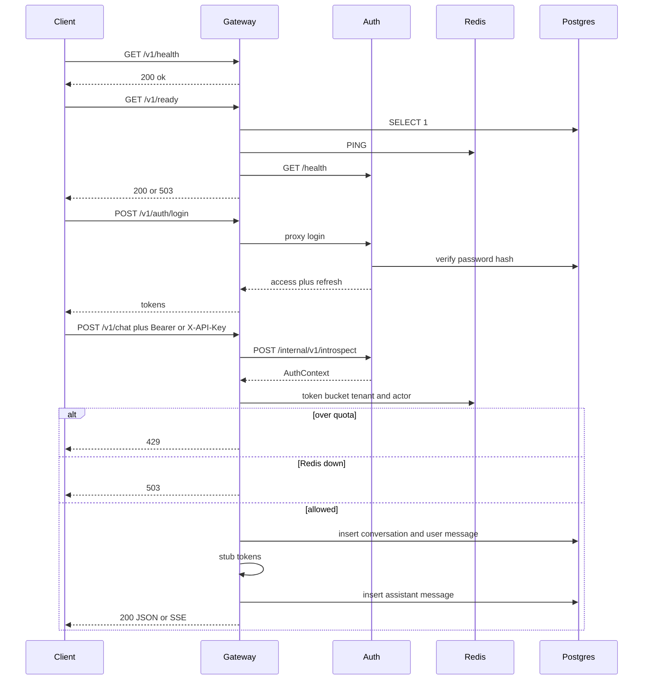
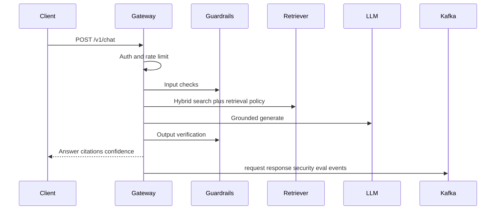

# Request path

## Version 3 (current)

The gateway is the only public port. Auth issues JWTs. Chat is a stub LLM with rate limits and persisted conversations.

## Target pipeline (later versions)

