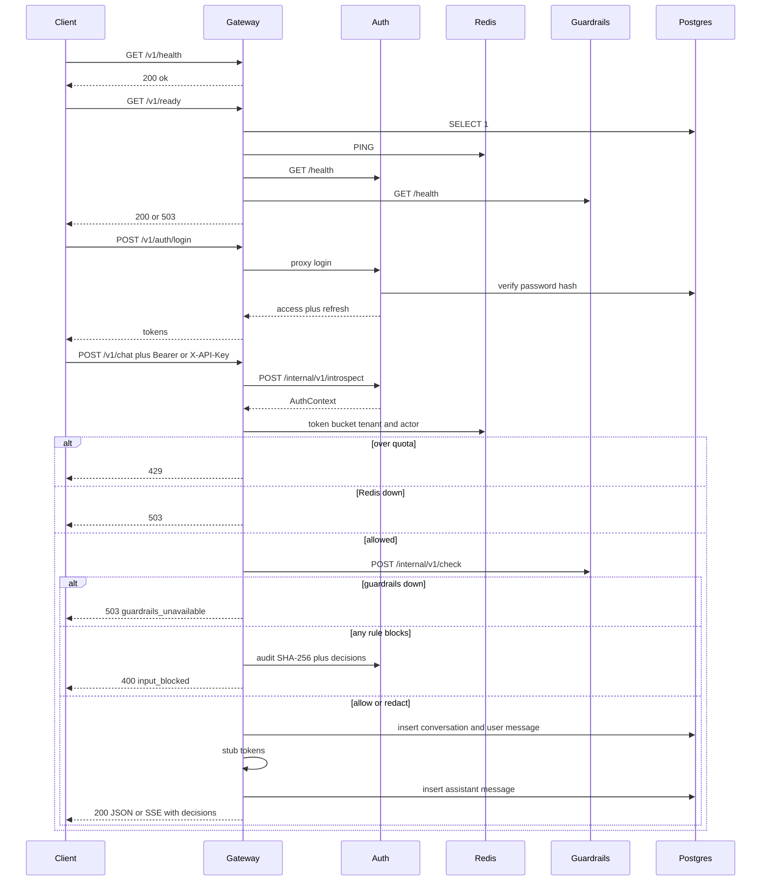
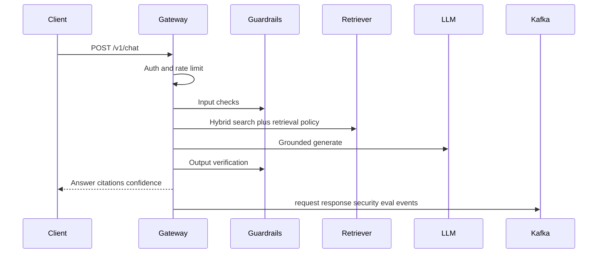

# Request path

## Version 4 (current)

The gateway is the only public port. Auth issues JWTs. After rate limits, the gateway calls `services/guardrails`. Chat is still a stub LLM. Unsafe prompts never reach the stub.

## Target pipeline (later versions)

