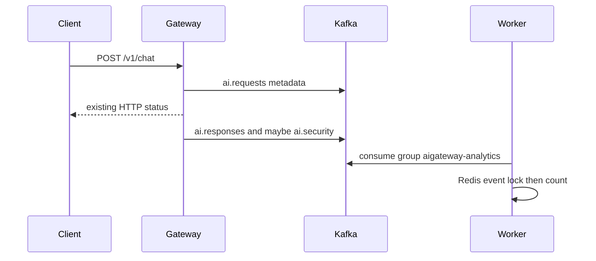
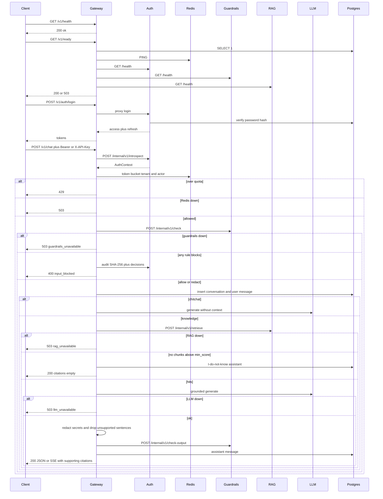

# Request path

## Version 8 (current)

The gateway is the only public port. After auth it publishes one `ai.requests` metadata event. Input guardrails, hybrid retrieve, grounded generate, secret redaction, citation verification, and the Jev output check are unchanged from Version 7. When the HTTP status is decided, the gateway publishes one `ai.responses` event and, for a block or redact, one `ai.security` event. Those publishes sit beside the HTTP response. A broker timeout or error is logged and does not change the status returned to the client. The worker consumes `ai.requests`, `ai.responses`, `ai.security`, and `ai.evaluations` in group `aigateway-analytics`. The gateway does not publish evaluation events. Payloads have no prompt, answer, chunk text, or secret span.

## Version 7

The gateway is the only public port. After input guardrails, it classifies the latest user message. Greetings skip retrieve. Knowledge questions call `services/rag` with the caller role. RAG runs a tenant filter, classification and acl checks, vector search, Postgres full-text search, reciprocal rank fusion, secret masking, a fixture rerank, dedupe, and an 8000-character budget. The gateway then calls `LLMClient.generate` with the chunks RAG returned. Each answer sentence must share at least half of its tokens with one of those chunks. Unsupported sentences are dropped. If none remain, the fixed I-don't-know string is returned. Secret spans in the answer are replaced with `[SECRET]` before that check. Empty retrieve hits return the same string without calling the LLM, and chitchat skips the sentence check. `groundedness` is the share of checked sentences that were kept. Streaming still generates fully, verifies, runs the Jev output check, then SSE-replays the final text. Citations on JSON and on `done` are the chunks that support a kept sentence. `debug: true` adds ranks and drop reasons for `security_admin` and `platform_admin` only, with no chunk text and no policy-denied rows.

## Target pipeline (later versions)

